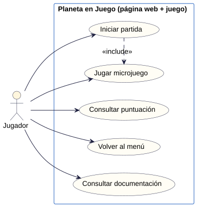

# Planeta en Juego · Análisis de requisitos

> **Documento de ejemplo · Actividad 1.** Recoge los requisitos del juego completo. En vuestro documento hay que añadir los requisitos, historias y tarjetas de cada microjuego.

**Prioridad:** Alta = imprescindible para la v1.0 · Media = importante, pero el juego funciona sin ello · Baja = solo si da tiempo.
**Origen:** *Enunciado* = lo pide la práctica · *Ten Pages* = lo decidió el grupo en [01-Ten_pages.md](01-Ten_pages.md).

## 1. Requisitos

### 1.1 Requisitos funcionales del juego

| ID | Descripción | Tipo | Prioridad | Origen |
| --- | --- | --- | --- | --- |
| RF-01 | El menú principal tiene un botón «Jugar» que inicia la partida. | Funcional | Alta | Enunciado |
| RF-02 | Al iniciar la partida, el jugador tiene 4 vidas y 0 puntos. | Funcional | Alta | Enunciado |
| RF-03 | ... | ... | ... | ... |

### 1.2 Requisitos no funcionales

| ID | Descripción | Tipo | Prioridad | Origen |
| --- | --- | --- | --- | --- |
| RNF-01 | El juego funciona en las versiones actuales de Chrome, Firefox y Edge de escritorio, sin instalar nada. | No funcional | Alta | Enunciado |
| RNF-02 | La web se publica en GitHub Pages desde la rama `main`, carpeta raíz. | No funcional | Alta | Enunciado |
| RNF-03 | ... | ... | ... | ... |

## 2. Historias de usuario

Una historia por funcionalidad. Cada criterio de aceptación tiene que poder comprobarse: en la Actividad 4 se convertirá en un caso de prueba.

### HU-01 · Iniciar partida

*Como jugador, quiero empezar una partida desde el menú para jugar cuando esté listo.*
Requisitos: RF-01, RF-02

- **CA-01.1** Dado que estoy en el menú principal, cuando pulso «Jugar», entonces empieza la partida con 4 vidas y 0 puntos.

### HU-02 · Volver a jugar o al menú

*Como jugador, quiero elegir entre jugar otra vez o volver al menú al acabar la partida para seguir jugando o consultar la web.*
Requisitos: RF-12

- **CA-08.1** Dado que estoy en la pantalla de fin, cuando pulso «Jugar otra vez», entonces empieza una partida nueva con 4 vidas y 0 puntos.
- **CA-08.2** Dado que estoy en la pantalla de fin, cuando pulso «Menú», entonces veo el menú principal.

### HU-03 · Consultar la documentación

*Como jugador, quiero consultar la documentación del proyecto desde la web para saber cómo se ha hecho el juego.*
Requisitos: RF-13

- **CA-09.1** Dado que estoy en la web del proyecto, cuando pulso «Ten Pages» en la barra de navegación, entonces veo el documento Ten Pages.
- **CA-09.2** Dado que estoy en la web del proyecto, cuando pulso «Trello», entonces se abre el tablero del grupo.

...

## 3. Diagrama de casos de uso

Diagrama hecho con PlantUML; el código fuente está en [img/casos-de-uso.puml](img/casos-de-uso.puml). «Iniciar partida» incluye «Jugar microjuego» porque toda partida consiste en jugar microjuegos hasta perder las vidas.

| Caso de uso | Qué hace el jugador | Historias |
| --- | --- | --- |
| Iniciar partida | Pulsa «Jugar» en el menú o «Jugar otra vez» en la pantalla de fin. | HU-01, HU-08 |
| Jugar microjuego | Lee la instrucción e intenta cumplir el objetivo antes de que acabe el tiempo. | HU-02, HU-03, HU-04, HU-06, HU-M1-01 a HU-M1-04 |
| Consultar puntuación | Ve las vidas, los puntos y el tiempo en el HUD, y la puntuación final al acabar. | HU-05, HU-07 |
| Volver al menú | Desde la pantalla de fin, vuelve al menú principal. | HU-08 |
| Consultar documentación | En la web, abre los apartados de documentación y el enlace a Trello. | HU-09 |

## 4. Registro de decisiones

Dudas que deja abiertas el enunciado o el diseño, y cómo las ha resuelto el grupo.

| ID | Duda | Decisión | Motivo | Afecta a |
| --- | --- | --- | --- | --- |
| D-01 | «Al superar los 10 y 20 puntos»: ¿el nivel 2 empieza con 10 o con 11 puntos? | Nivel 2 con 10 puntos o más; nivel 3 con 20 o más. | Quien ha superado 10 microjuegos tiene 10 puntos, así que el siguiente ya debe ser más difícil. | RF-08 |
| D-02 | ¿Cuántos puntos da cada microjuego? | 1 punto por microjuego superado. | Así los umbrales de 10 y 20 puntos equivalen a 10 y 20 microjuegos superados. | RF-05 |
| D-03 | ¿En qué orden salen los microjuegos? | Aleatorio, sin repetir el anterior. | Una partida predecible aburre, y el mismo microjuego dos veces seguidas parece un error. | RF-03 |
| D-04 | En M1, ¿se gana al llenar el vaso o al acabar el tiempo? | En cuanto se llena el vaso. | Premia la rapidez y mantiene el ritmo de la partida. | RF-M1-04 |
| D-05 | En M1, ¿penalizan las gotas que caen fuera? | No. | El microjuego tiene un único objetivo: llenar el vaso a tiempo. | RF-M1-03 |
| D-06 | ¿Se guarda la mejor puntuación? | No, en esta versión. | No lo pide el enunciado; el ranking es una ampliación opcional que necesita servidor. | — |
| D-07 | En M1, ¿ratón, teclado o ambos? | Ambos: ratón y flechas. | El enunciado admite cualquiera; con los dos se puede jugar también sin ratón. | RF-M1-01 |
| D-08 | ¿La pantalla de instrucción cuenta dentro del tiempo límite? | No: dura 1,5 s y el tiempo empieza después. | El tiempo límite es para jugar, no para leer. | RF-04 |

## 5. Matriz de trazabilidad inicial

Cada historia es una tarjeta del backlog de Trello. Las columnas **PR** y **Caso de prueba** se completan en las actividades 3 y 4.

**Esfuerzo:** S = una sesión o menos · M = entre una y dos sesiones · L = más de dos sesiones (mejor dividirla en varias tarjetas).

| Requisito | Historia | Tarjeta de Trello | Etiqueta | Esfuerzo | PR (A3) | Caso de prueba (A4) |
| --- | --- | --- | --- | --- | --- | --- |
| RF-01, RF-02 | HU-01 | T-01 · Iniciar partida | motor | S | | |
| RF-03, RF-04, RF-10 | HU-02 | T-02 · Encadenar microjuegos | motor | M | | |
| RF-05 | HU-03 | T-03 · Sumar puntos | motor | S | | |
| RF-06 | HU-04 | T-04 · Perder una vida al fallar | motor | S | | |
| RF-07 | HU-05 | T-05 · Fin de partida | motor | S | | |
| RF-08 | HU-06 | T-06 · Dificultad progresiva | motor | M | | |
| RF-11 | HU-07 | T-07 · HUD | motor | M | | |
| RF-12 | HU-08 | T-08 · Volver a jugar o al menú | motor | S | | |
| RF-13 | HU-09 | T-09 · Documentación en la web | web | M | | |
| RF-09, RF-M1-01 | HU-M1-01 | T-10 · M1: mover el vaso | microjuego | S | | |
| RF-M1-02, RF-M1-03 | HU-M1-02 | T-11 · M1: recoger gotas | microjuego | M | | |
| RF-M1-04, RF-M1-05 | HU-M1-03 | T-12 · M1: ganar o perder | microjuego | S | | |
| RF-M1-06 | HU-M1-04 | T-13 · M1: tres niveles | microjuego | M | | |
| RNF-02 | — | T-14 · Publicar en GitHub Pages | web | S | | |
| RNF-01, RNF-03, RNF-05 | — | Se comprueban en todas las tarjetas y en la Actividad 4 | — | — | | |
| RNF-04 | — | Hecho en la Actividad 0 | — | — | | |
| RNF-06 | HU-02 | T-02 · Encadenar microjuegos | motor | M | | |

Tarjetas de documentación, sin requisito asociado: **T-15 · Redactar el Ten Pages** (docs, M) y **T-16 · Redactar el análisis** (docs, M).

### Ejemplo de tarjeta en Trello

> **T-04 · Perder una vida al fallar**
> Etiqueta: `motor` · Esfuerzo: `S`
>
> *Como jugador, quiero perder una vida al fallar un microjuego para que fallar tenga consecuencias.*
>
> Checklist de aceptación:
> - [ ] CA-04.1 Dado que tengo 2 vidas, cuando se agota el tiempo sin cumplir el objetivo, entonces me queda 1 vida y empieza otro microjuego.
>
> Requisito: RF-06 · Rama prevista: `features/perder-vida`
