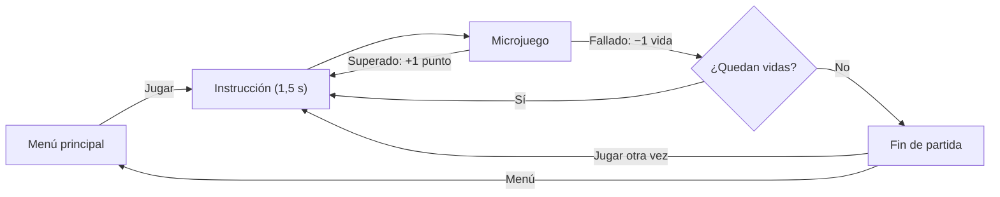
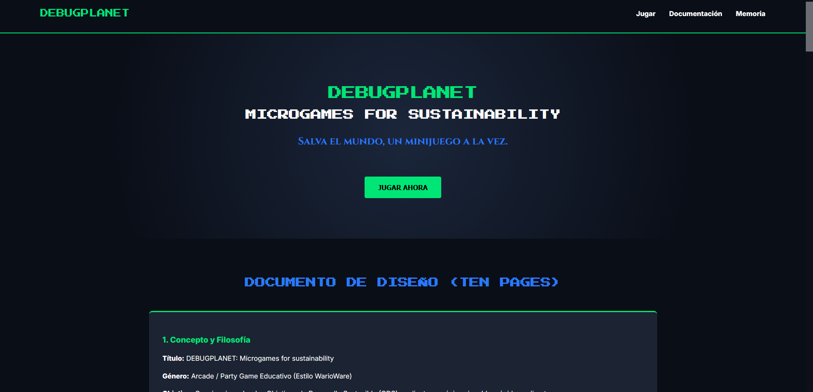

# Planeta en Juego · Ten Pages

> **Documento de ejemplo · Actividad 1.** Describe el juego completo, pero solo incluye **una** ficha de microjuego: «¡No malgastes agua!». En vuestro documento tiene que haber una ficha por microjuego (6 en parejas, 9 en tríos).

| Dato | Valor |
| --- | --- |
| **Título** | Planeta en Juego |
| **Género** | Microjuegos encadenados de reflejos |
| **Plataforma** | Navegador de escritorio, publicado en GitHub Pages |
| **ODS tratados** | 2, 3, 6, ... |
| **Equipo** | ... |
| **Entrega** | `e1-analisis` |

## 1. Concepto

Planeta en Juego lanza al jugador una serie de microjuegos de pocos segundos, cada uno sobre un Objetivo de Desarrollo Sostenible. Cada acierto suma un punto y cada fallo cuesta una de las 4 vidas. Cuanto más aguanta, más difíciles se vuelven los microjuegos.

## 2. Bucle de juego

1. Desde el menú, el jugador pulsa **Jugar** y empieza con 4 vidas y 0 puntos.
2. Antes de cada microjuego aparece su instrucción y su ODS durante 1,5 s.
3. El jugador tiene unos segundos para cumplir el objetivo.
4. Si lo cumple, suma 1 punto. Si falla, pierde 1 vida.
5. Mientras le queden vidas, llega otro microjuego distinto del anterior.
6. Con 0 vidas aparece la pantalla de fin con la puntuación final.

## 3. Mecánicas comunes

| Mecánica | Regla | Justificación |
| --- | --- | --- |
| Vidas | 4 al empezar; cada microjuego fallado resta 1. Con 0, fin de partida. | Lo pide el enunciado. |
| Puntos | +1 por cada microjuego superado. | Un punto por microjuego hace que los umbrales de 10 y 20 puntos signifiquen «10 y 20 microjuegos superados» (decisión D-02). |
| Niveles | Nivel 1 con 0–9 puntos, nivel 2 con 10–19, nivel 3 con 20 o más. | Interpretación de «al superar los 10 y 20 puntos» (decisión D-01). |
| Orden | Aleatorio, sin repetir el microjuego anterior. | Evita que la partida sea predecible y que el mismo reto salga dos veces seguidas (D-03). |
| Instrucción | 1–2 palabras e icono del ODS durante 1,5 s, fuera del tiempo límite. | Da tiempo a leer sin restar tiempo de juego (D-08). |
| Tiempo límite | Cada microjuego tiene el suyo, visible en el HUD como número y barra. | El enunciado exige tiempo límite; verlo ayuda a decidir. |
| Controles | Ratón y/o teclado, según la ficha de cada microjuego. | Lo pide el enunciado. |

Las decisiones D-01 a D-08 están explicadas en el registro de decisiones de [02-Analisis.md](02-Analisis.md#4-registro-de-decisiones).

## 4. Reparto de microjuegos y ODS

Criterio del grupo: cada ODS aparece una sola vez y cada persona combina microjuegos de ratón y de teclado.

| # | Microjuego (título provisional) | ODS | Autor/a | Ficha |
| --- | --- | --- | --- | --- |
| M1 | ¡No malgastes agua! | 6 · Agua limpia y saneamiento | ... | Completa (sección 5) |
| M2 | ¡Apaga la luz! | 7 · Energía asequible y no contaminante | ... | No incluida en el ejemplo |
| M9 | ¡Pedalea! | 11 · Ciudades y comunidades sostenibles | ... | No incluida en el ejemplo |
| ... | ... | ... | ... | ... |

## 6. Bocetos

### Menú principal

## 7. Estilo visual

- **Gráficos:** pixel art de colores planos; cada microjuego usa como acento el color de su ODS.
- **Texto:** instrucciones en mayúsculas y grandes, legibles en menos de 1,5 s.
- **Sonido (opcional, si da tiempo):** un efecto corto para acierto y otro para fallo.
